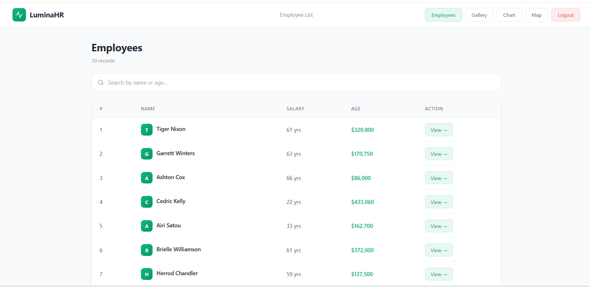
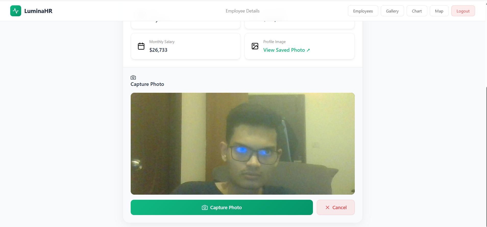
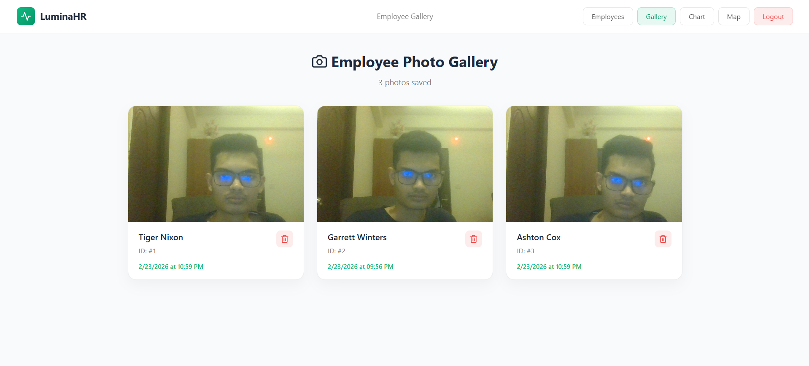
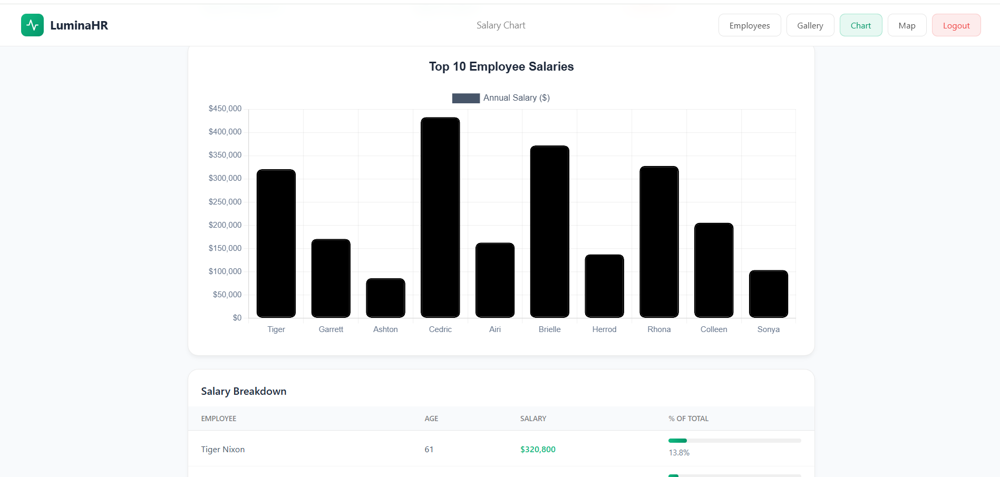
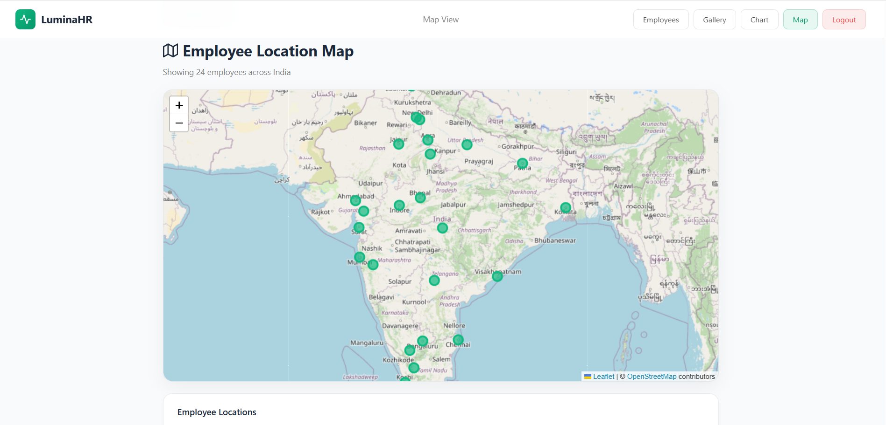

<div align="center">
  
  <h1>LuminaHR</h1>
  <p><strong>A Modern, Comprehensive Employee Management Platform</strong></p>
</div>

---

## 🚀 Technologies Used

Here are the robust technologies utilized to build this scalable platform:


---

## 🏗️ Architecture & Overview

**LuminaHR** is designed as a dynamic Single Page Application (SPA) driven by React and Vite. It heavily focuses on a clean, modern user experience with a responsive interface logic that dynamically adapts to mobile and desktop screens. 

### Key Modules:
* **Authentication**: A secure entry point simulating login credentials.
* **Data Layer**: An intuitive split-architecture data flow. The app attempts to fetch data from an external REST API first; if that rate limits or fails, it gracefully falls back to a populated Google Firebase Cloud Firestore database.
* **Storage Layer**: Utilizing Firebase Storage for secure image uploading. Captured web-camera photos are uploaded as blobs, and their absolute Firebase CDN links are saved directly back into Firestore documents alongside the respective Employee IDs.
* **Map Engine**: Uses `react-leaflet` to map employee geographical data using an open-source mapping architecture.
* **Visualization Layer**: Intersects Chart.js with React to dynamically map JSON arrays into digestible horizontal and vertical chart matrices.

---

## ✨ Features Showcase

### 1. Interactive Employee List
A responsive table allowing you to search effectively through the roster.


### 2. Live Web-Camera Capture
Navigate to any employee's details page to instantly connect your camera and capture their profile photo! Photos are saved to the cloud securely in real-time.


### 3. Chronological Photo Gallery
A masonry-style gallery displaying all cloud-storage images in chronological order by Employee ID! Features rapid deletion logic.


### 4. Interactive Data Analytics
Dynamic Bar Charts allowing visual breakdowns of company payrolls, highest earners, and scalable percentages.


### 5. Geographical Mapping
Renders an interactive geographical node-map distributing fictional employees across major business hubs. Features reactive tooltip bindings!


---

## 🛠️ Installation & Setup

Want to run this locally? Follow these simple steps:

1. **Clone the repository:**
   ```bash
   git clone [your-repository-link]
   ```
2. **Navigate into the directory:**
   ```bash
   cd jotishassing
   ```
3. **Install dependencies:**
   ```bash
   npm install
   ```
4. **Environment Variables:**
   Rename `.env.example` to `.env` and fill out your Firebase configuration keys!
5. **Start the Development Server:**
   ```bash
   npm run dev
   ```

## 🌐 Deployment
This application includes a customized `vercel.json` routing matrix ensuring absolute flawless SPA delivery via [Vercel](https://vercel.com/). 
